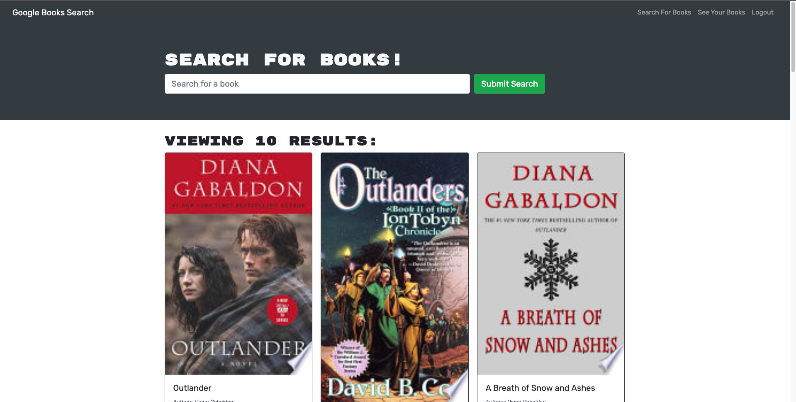

# Book Search Engine MIT 
  ## Description
  The motivation for this project was to set up an Apollo Server to use GraphQL queries and mutations to fetch and modify data. I built this project to refactor the existing RESTful API with the GraphQL API. I learned how to create an Apollo Provider to communicate with the Apollo Server, implement GraphQL queries and mutations and deploy to Heroku with a MongoDB database.

  ## Table of Contents
  - [Installation](#installation)
  - [Usage](#usage)
  - [Credits](#credits)
  - [License](#license)
  
  ## Installation
  [Link to Deployed Site](https://nameless-reaches-44017.herokuapp.com/)

  ## Usage

  
  
  ## Credits
  React, Apollo Server, GraphQL

  ## License
  

  Copyright 2022 Tina Stanczyk

  Permission is hereby granted, free of charge, to any person obtaining a copy of this software and associated documentation files (the "Software"), to deal in the Software without restriction, including without limitation the rights to use, copy, modify, merge, publish, distribute, sublicense, and/or sell copies of the Software, and to permit persons to whom the Software is furnished to do so, subject to the following conditions:
  
  The above copyright notice and this permission notice shall be included in all copies or substantial portions of the Software.
  
  THE SOFTWARE IS PROVIDED "AS IS", WITHOUT WARRANTY OF ANY KIND, EXPRESS OR IMPLIED, INCLUDING BUT NOT LIMITED TO THE WARRANTIES OF MERCHANTABILITY, FITNESS FOR A PARTICULAR PURPOSE AND NONINFRINGEMENT. IN NO EVENT SHALL THE AUTHORS OR COPYRIGHT HOLDERS BE LIABLE FOR ANY CLAIM, DAMAGES OR OTHER LIABILITY, WHETHER IN AN ACTION OF CONTRACT, TORT OR OTHERWISE, ARISING FROM, OUT OF OR IN CONNECTION WITH THE SOFTWARE OR THE USE OR OTHER DEALINGS IN THE SOFTWARE.
  
  

  https://opensource.org/licenses/MIT

  ## Badges
  Not applicable

  ## Features
  Not applicable

  ## How to Contribute
  Invest in future development!

  ## Tests
  Not applicable

  ## Questions
  Contact me here if you have further questions: 

  Email - t9.stanczyk@gmail.com 

  Github - https://github.com/tinastanczyk 